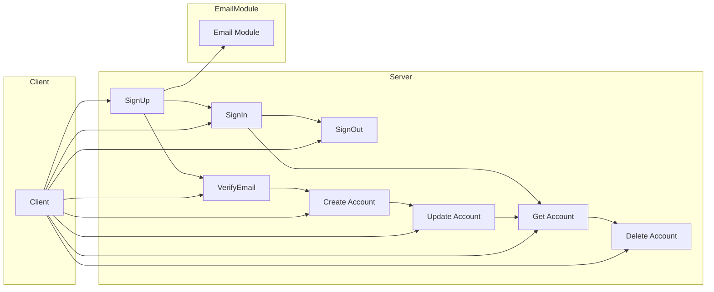
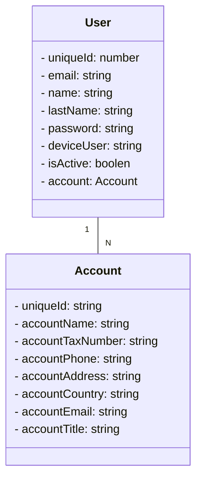
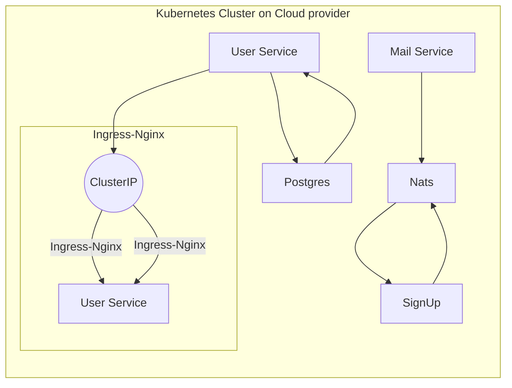

# e-rct-task with microservices and kubernetes


<!-- PROJECT LOGO -->
<br />
<div align="center">
  <a href="https://github.com/othneildrew/Best-README-Template">
    
  </a>

  <h3 align="center">E-rct-task</h3>

  <p align="center">
    An awesome e-rct-task!
    <br />
    <a href="https://github.com/nurie487/e-rct-task/-/blob/main/README.md"><strong>Explore the docs »</strong></a>
    <br />
    <br />
    <a href="https://githab.com/nurie487/e-rct-task">View Demo</a>
    <a href="https://githab.com/nurie487/e-rct-task/-/issues">Request Feature</a>
  </p>
</div>


 
<!-- ABOUT THE PROJECT -->
## About The Project With  Workflow

- This project has been created by company for the purpose of task. The purpose of the project is to demonstrate and handle CRUD operations, authentication process, Kubernetes, error handling, TypeScript, microservices, and TypeORM, middleweare, eventBus, nats-streaming-server, queue topics vb.

- In the User module, operations related to user and authentication have been implemented, and request-response structures have been created for the endpoints related to these operations. Each user has one account, and each account can have multiple users, designed in that way. Overall, communication between different modules is achieved through event streaming using NATS. Operations such as deleting or updating an account are performed based on the accountId belonging to the person in the token.
 
 



- ### Endpoints - Account

    - Endpoint: `/api/user/account` 
        -  (Create): This endpoint is used to create a new account
    - Endpoint: `/api/user/account`
        -   (Get):This endpoint is used to list account.
    - Endpoint: `/api/user/account`
        -  (Update):  This endpoint is used to update a account.
    - Endpoint: `/api/user/account`
        -  (Delete): This endpoint is used to delete a account.
    
  - !Important: `The endpoints above are protected by authentication.`
  - !Important: `This account endpoint does not expect an ID from the client; it utilizes the account ID of the logged-in user.`
- ### Endpoints - Auth

    - Endpoint: `/api/user/signup` 
        -  (SignUp): This endpoint is used to create a new user
    - Endpoint: `/api/user/signin`
        -   (SignIn):This endpoint is used to login user.
    - Endpoint: `/api/user/signout`
        -  (SignOut):  This endpoint is used to logout a user.
    - Endpoint: `/api/user/verify-email`
        -  (VerifyEmail): This endpoint is used to verify a user's email.
  

  


- ### Error Handling 

  - `In the project, error handling was done over the Middleware concept with the library I wrote.` 
   
    `1: Request Validation Error`: When the condition in the request body is not met, the RequestValidationError class is used to generate an error. This error is then passed through the errorHandler middleware, where it is serialized and sent as a response to the client.

    `2: NotFoundError and Similar Errors`: In this case, after the custom Error object is handled by the errorHandler middleware, it is serialized and returned to the client as a response in an appropriate format.
  - `If you have any question, please do not hesitate to ask.`
 
- ### Database Schema

  - `In the project, PostgreSql was used as the database. The database schema is as follows:`
 
 


 

## Tech Stack

- This section lists all major frameworks/libraries used to boot the project.


 
 

## Kubernetes Process



<!-- GETTING STARTED -->
## Getting Started

This is an example of how you may give instructions on setting up your project locally.
To get a local copy up and running follow these simple example steps.

### Prerequisites

This is an example of how to list things you need to use the software and how to install them.
* npm
  ```sh
  npm install npm@latest -g
  ```

### Installation

Below is an example of how you can instruct your audience on installing and setting up your app.  

### How to run on your local machine
 
1. Clone the repo
   ```sh
   git clone https://gitlab.com/nurie487/book-app.git
   ```
2. Install NPM packages
   ```sh
   npm install
   ```
3. Add environment variables
   ```sh
   cp .env /path/to/your/project
   
   ```
   - 3.1: `Optional`: If you don't have .env file, you can create .env file with the following command.
    ```sh
    touch .env
    ```
    - 3.2: `Optional`: You can add the following environment variables to the .env file.
      ```sh
      NODE_ENV
      PORT
      AUTH_HOST
      DB_NAME
      DB_HOST
      DB_PASS
      DB_PORT
      DB_USER
      JWT_KEY
      JWT_EXPIRES_IN
      NATS_CLIENT_ID
      NATS_URL
      MAIL_HOST
      USER_MAIL_AUTH
      USER_MAIL_PASSWORD
      ```
      - `Also, you will need to run the 'nats' and 'database server' locally`

4. Run Package.json file command
    ```sh
    npm run dev  
     ```
 
 
 
## How to run the project with kubernetes on Minikube

- ### Minikube kubernetes set

    ```
    minikube start
    minikube ip
    ```


- ### minikube ingress-nginx setting

    ```
    minikube addons enable ingress
    ```

- ### minikube create secret for running the project on kubernetes

    ```
    kubectl create secret generic jwt-secret  --from-literal=JWT_KEY=
   
    ```

- ### and then start skaffold.yaml

    ```
    skaffold dev
    ```

- ### Skaffold
    - `skaffold dev`

### What is Skaffold?

-   Skaffold is a command line tool that facilitates continuous development for Kubernetes applications. You can iterate on your application source code locally then deploy to local or remote Kubernetes clusters. Skaffold handles the workflow for building, pushing and deploying your application. It also provides building blocks and describe customizations for a CI/CD pipeline.
 

<!-- CONTRIBUTING -->
## Contributing

Contributions are what make the open source community such an amazing place to learn, inspire, and create. Any contributions you make are **greatly appreciated**.

If you have a suggestion that would make this better, please fork the repo and create a pull request. You can also simply open an issue with the tag "enhancement".
Don't forget to give the project a star! Thanks again!

1. Fork the Project
2. Create your Feature Branch (`git checkout -b feature/AmazingFeature`)
3. Commit your Changes (`git commit -m 'Add some AmazingFeature'`)
4. Push to the Branch (`git push origin feature/AmazingFeature`)
5. Open a Pull Request
 

<!-- LICENSE -->
## License

Distributed under the MIT License. See `LICENSE.txt` for more information.


<!-- CONTACT -->
## Contact

Nurettin Şen - [ ](gmail.com) - nurie487@gmail.com
 

